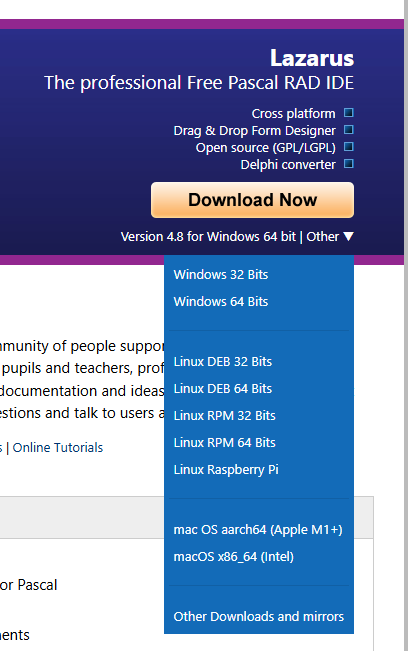

# TR4W — Build & Test Recipe

> **Renamed from `D12_BUILD.md` on 2026-08-13.** This file is named for the
> *job*, rather than the compiler. The repository remains `TR4W-D12` for
> continuity, although the supported build is now FreePascal + Lazarus.

**Toolchain: Git, FreePascal 3.2.2 + the Lazarus LCL.** Delphi is behind us. The FPC build passes the
unit tests (4165/0) and the golden corpus (22/0/4), runs the LCL UI, and is what ships.

## Setting up Git

If Git is already installed on your system, skip this section.

Install Git from <https://git-scm.com/install/> using the Windows installer.

## Clone the repository

Choose a working directory, then clone the repository:

```bat
mkdir %USERPROFILE%\projects
cd /d %USERPROFILE%\projects
git clone https://github.com/TR4W/TR4W-D12.git
cd TR4W-D12
```

This creates a new `TR4W-D12` folder containing the source tree.

`%USERPROFILE%` expands to your own `C:\Users\<you>`, so the block above can be
pasted as it stands. Anywhere you can write is fine — the build discovers its
tools and never assumes where the source lives. A folder off the root of `C:`
works too, but avoid it: creating one needs elevation from Explorer (even though
plain `mkdir` usually succeeds), and locked-down machines refuse it outright.

## Build environment

TR4W is a 32-bit (`i386-win32`) application. Use the 32-bit Lazarus + FPC toolchain, because a default 64-bit Pascal installation usually fails late and produces misleading errors.

### One installer, and that is genuinely all

Install **`lazarus-4.8-fpc-3.2.2-win32.exe`** — the **32-bit** Lazarus — from <https://www.lazarus-ide.org/> (or SourceForge, under *Lazarus Windows 32 bits*).
The site usually defaults to the 64-bit Windows build, so be sure to select the 32-bit installer.



## Verify before you build

One command answers the only question that matters — *what will the build actually use*.
Run it from a **cmd prompt** — see [If PowerShell refuses to run the scripts](#if-powershell-refuses-to-run-the-scripts) — and **from the repo root**, since every path in this document is written relative to it:

```bat
tr4w\build\Find-Toolchain.cmd
```

It should name an `fpc.exe` under `bin\i386-win32` and an LCL unit directory ending `lcl\units\i386-win32`.
When it cannot find a usable toolchain it prints **every path it tried**, which is the first thing to read — and the first thing to paste if you ask for help.

Then, from the repo root, the quickest way to get a first successful build on a fresh machine is the wrapper:

```bat
utils\Build.cmd
```

Those wrappers avoid PowerShell execution-policy friction on a fresh Windows install.
The PowerShell forms are equivalent and are shown just below:

```powershell
.\tr4w\FullBuild.ps1                  # lints, unit tests, app, server
```

A clean machine to a shippable installer is **one installer, one clone, one command** — about 2.5 minutes of build time.

Tool locations are **discovered**, not configured. `tr4w\build\Find-Toolchain.ps1` searches `PATH`, the usual install roots, and the `FPC_HOME` / `LAZARUS_DIR` environment variables, and prints every path it tried when it fails.
Setting those variables is usually only needed for a non-default install or CI.

**The drive does not matter.** The usual roots (`\FPC`, `\Lazarus`, `\fpcupdeluxe\...`) are searched on **every fixed drive**, so a toolchain on `D:` is found exactly like one on `C:`.
Removable, optical and network drives are skipped deliberately: discovery must not depend on what happens to be plugged in, and an unready network drive can stall the search on every build.
What is *not* searched is `Program Files` — if you installed there, or anywhere else unusual, use the pin below.

Pin them explicitly on CI:

```powershell
$env:FPC_HOME    = 'C:\FPC\3.2.2'
$env:LAZARUS_DIR = 'C:\Lazarus'
```

**A pin is authoritative.** If `FPC_HOME` / `LAZARUS_DIR` (or `-Fpc` / `-Laz`) names something that cannot build TR4W, the build **fails** naming what was rejected — it does not quietly fall back to another install.
That distinction matters on a runner, where a silent substitution means you are shipping from a toolchain nobody configured.

## If PowerShell refuses to run the scripts

Windows ships with PowerShell script execution **disabled** (`ExecutionPolicy = Restricted`), so on a machine nobody has prepared, every `.ps1` in this document fails before it runs a single line:

```text
... cannot be loaded because running scripts is disabled on this system.
```

That is the default state of a fresh Windows install, not a misconfiguration. **Every build script here has a `.cmd` twin beside it** that runs the same script with `-ExecutionPolicy Bypass`, and those work from a plain `cmd` prompt with nothing set up:

| PowerShell                                               | cmd                                             |
| -------------------------------------------------------- | ----------------------------------------------- |
| `. .\tr4w\build\Find-Toolchain.ps1 ; Find-Tr4wToolchain` | `tr4w\build\Find-Toolchain.cmd`                 |
| `.\tr4w\FullBuild.ps1`                                   | `tr4w\FullBuild.cmd`                            |
| `.\tr4w\build\Build-App.ps1`                             | `tr4w\build\Build-App.cmd`                      |
| `.\tr4w\build\Build-Tests.ps1 -Run`                      | `tr4w\build\Build-Tests.cmd -Run`               |
| `.\tr4w\build\Build-Server.ps1`                          | `tr4w\build\Build-Server.cmd`                   |
| `.\tr4w\build\Run-Lints.ps1`                             | `tr4w\build\Run-Lints.cmd`                      |
| `.\tr4w\build\Test-FreshClone.ps1 -WithInstaller`        | `tr4w\build\Test-FreshClone.cmd -WithInstaller` |

Each wrapper resolves its own directory (`%~dp0`), so it works from any current directory; forwards all arguments; and returns the script's exit code, so a failing lint or test still fails the command.

Four things worth knowing:

- **Run the `.cmd` itself. Do not type `cmd` in front of it, and do not aim it at the `.ps1`.** `cmd tr4w\FullBuild.ps1` does not build anything. Without `/c` or `/k`, `cmd.exe` ignores a bare argument, prints its version banner and drops you into a *nested* command prompt — so it returns instantly, writes nothing to `target\`, and looks like a build that failed silently. No build ran at all. The command is `tr4w\FullBuild.cmd`. (Reported by N4AF, 2026-08-19.)
- **`FullBuild` lives in `tr4w\`, not in `tr4w\build\`.** The two are easy to confuse because every *other* script in the table is under `build\`. Run it from the repo root as `tr4w\FullBuild.cmd`, or use `utils\Build.cmd`, which is the same build.
- **`-ExecutionPolicy Bypass` on the command line changes nothing on the machine.** It applies to that one PowerShell process. It needs no elevation, and it is not the same as `Set-ExecutionPolicy`.
- **`Find-Toolchain.cmd` is the odd one out.** `Find-Toolchain.ps1` is a *library* — running it does nothing, it only defines `Find-Tr4wToolchain` — so its wrapper dot-sources and calls the function rather than using `-File`. A consequence: its arguments are parsed by PowerShell, so a path with spaces needs **single** quotes (`-Laz 'C:\Program Files\Lazarus'`). The other wrappers take ordinary cmd double quotes.
- If a Group Policy has set the execution policy at machine or user scope, `Bypass` on the command line is refused and even the `.cmd` fails. That is a managed-machine question for whoever manages it — the wrappers cannot work around it and deliberately do not try.

`utils\Build.cmd` and `utils\BuildEnglishInstaller.cmd` already worked this way and are unchanged; `tr4w\FullBuild.cmd` is the same call, placed so the path in this document substitutes one-for-one.

## Everything at once

### Also needed, for the installer only

To build an installer you need **NSIS** (`makensis.exe`), from
<https://nsis.sourceforge.io/Download>. The default install location
`C:\Program Files (x86)\NSIS` is what the build looks for.

Nothing else: Indy 10.6.3.3 is vendored in `tr4w\include`, so there is no
dependency to fetch.

```powershell
.\tr4w\FullBuild.ps1                    # lints -> unit tests -> app -> tr4wserver
.\tr4w\FullBuild.ps1 -BuildInstaller    # + the NSIS installer
```

Or the wrappers, which work from any directory:

```bat
utils\Build.cmd
utils\BuildEnglishInstaller.cmd
```

Order is deliberate: **a failing test stops the build before it produces a binary anyone could ship.**
The version comes from `tr4w\src\Version.pas`; the script *fails* rather than defaulting if it cannot parse it, and afterwards checks the linked `tr4w.exe` actually reports that version — so a version resource that failed to link cannot ship silently.

**One build, English only.** The nine per-language variants are gone; translation moves to `resourcestring`. Do not reintroduce a language loop.

## Iterating

```powershell
.\tr4w\build\Build-App.ps1                 # full rebuild (-B), the safe default
.\tr4w\build\Build-App.ps1 -Incremental    # seconds instead of minutes
.\tr4w\build\Build-Tests.ps1 -Run          # build the suite, then run it
.\tr4w\build\Build-Server.ps1              # tr4wserver
```

- **`-Incremental` is for chasing one defect, not for believing a result.** FPC's mtime rule cannot see a changed compiler switch, a changed `.inc`, or a define flip. Do a full build before you commit on anything.
- **A designed form is two files and FPC only watches the `.pas`.** Editing a `.lfm` leaves the `.pas` older than its unit file, so an incremental build silently keeps the previous resource. `Build-App.ps1` touches a `.pas` whose `.lfm` is newer to compensate.
- Intermediate output goes to `build-out\` at the repo root (gitignored). Binaries land where they ship: `tr4w\target\tr4w.exe` and `tr4w\tr4wserver\tr4wserver.exe`.
- **The unit-test exe must live in `tr4w\test\unit\`** — several suites resolve their data relative to `ParamStr(0)`, not the working directory (`fixtures\`, `..\..\target\cty.dat`). Built anywhere else you get 30 red CTYDAT tests and a bare RTE 217, neither of which names the real cause.

## Advanced setups

### Keeping a 64-bit Lazarus install

If you already run a 64-bit Lazarus and would rather not replace it, you can add the missing i386 LCL units yourself — this is how the reference machine got there, and `lazbuild` is unattended so it scripts fine:

```powershell
C:\Lazarus\lazbuild.exe --cpu=i386 --os=win32 --ws=win32 C:\Lazarus\lcl\lclbase.lpk
C:\Lazarus\lazbuild.exe --cpu=i386 --os=win32 --ws=win32 C:\Lazarus\lcl\interfaces\lcl.lpk
```

You still need a **32-bit FPC** beside it (<https://www.freepascal.org/download.html>, the `i386-win32` installer, default `C:\FPC\3.2.2`). Two installers and two commands instead of one installer — which is why the 32-bit Lazarus is the recommendation.

### On fpcupdeluxe

A fine way to *obtain* FPC and Lazarus, and how the reference machine originally got there. But **its own tree is not the toolchain the build uses**: on that machine `C:\fpcupdeluxe\fpc\units\i386-win32` and `C:\fpcupdeluxe\lazarus\lcl\units\i386-win32` do not exist, because that install is x86_64-only. You do not need it for TR4W.

Whatever you install with, the test is not "which tool did I use" — it is the checks above.

### The IDE is optional

Only the **LCL** is used. TR4W is not a Lazarus *project* in the usual sense: it runs its own `GetMessage` loop and never calls `Application.Run`. The IDE is a convenience for editing the four designed forms — open `tr4w\tr4w.lpi` — not a build dependency.

## Lints

`tr4w\build\Run-Lints.ps1` runs all ten, and `FullBuild.ps1` calls it. They previously lived only in `tr4w.lproj`'s `PreBuildEvent`, so msbuild ran them and **nothing else did** — an FPC build saw none. Add a lint by editing the one array in that script.

`Lint-LFMProperties` is the odd one out: it compiles a small FPC helper (`build\lintlfm\`) that links the LCL and asks the same RTTI the form loader uses, because "does this class publish this property, and is this a legal value for it" cannot be answered by grepping a `published` block. It fails *closed* if FPC or the LCL is missing — a lint that cannot run must not look like a lint that found nothing.

## Unit tests

4165 tests, 0 failures is the baseline — **0 failures is the part that matters.** The count grows
as tests are added, so take the number from your own run rather than this page; if yours is *lower*,
the checked-in exe is stale. The DUnit-compatible runner links the leaf `src` units (ADIF, Cabrillo, callsign, mults, CTY.DAT, band, CRC32, grid/distance, text/file/math, Icom CI-V, Flex, freq/time). It does **not** exercise the TRDOS contest engine, which needs the app's globals booted — so `ProcessExchange`, scoring and dupe are covered by the corpus below, not here.

It does currently link the LCL, transitively: a suite links `uCAT`, and `uCAT` uses `uPrefsForm`. That is worth removing at the `uCAT` seam — a unit-test binary should not depend on a UI toolkit.

## Golden-master corpus (the regression oracle)

How we prove a change is behaviour-preserving. It runs the app's headless export (`tr4w.exe "<contest>.CFG" /EXPORT` — boots the contest, writes ADIF + Cabrillo, then `Halt`s before any GUI or network init) for each corpus set and byte-diffs both artifacts against frozen **D7** references.

**Rebuild the app first**, then from the repo root:

```bash
bash tr4w/test/corpus/export-d12-corpus.sh            # all sets, then sweep
bash tr4w/test/corpus/export-d12-corpus.sh <slug>     # one set (smoke test)
TR4W_EXE=other.exe bash tr4w/test/corpus/export-d12-corpus.sh   # a different binary in target\
```

- **Baseline: `22 passed, 0 failed, 4 known-divergence, 0 awaiting-candidate`.** That is GREEN.
- Fail-loud: a set with a reference but no *fresh* candidate is a **FAIL**, so a stale or aborted export cannot mask a gap.

### Collision guard

The corpus launches `tr4w.exe` once per set and uses `tr4w\target\`. **If you are running TR4W, every set collides and reports FAIL** — a false alarm, seen twice (once as `8/22`, once as `0/22`). TR4W is single-instance: the second process hits the mutex and exits *before* the `/EXPORT` handler, so it writes nothing. Check first:

```powershell
$p = Get-Process -Name tr4w, tr4w_fpc -ErrorAction SilentlyContinue
if ($p) { "RUNNING (pid $($p.Id)) -- HOLD the corpus" } else { "not running -- safe" }
```

**Run the corpus, read the result, THEN commit.** Never chain the corpus run and `git commit` in one shell block — a false FAIL then looks committed.

## Proving a clone builds

```powershell
.\tr4w\build\Test-FreshClone.ps1 -WithInstaller
```

Clones `HEAD` to a temp directory, builds with **no arguments**, asserts the artifacts exist, and diffs the binary sizes against the working tree's. That last check is not decoration: it caught an untracked `tr4wserver.res` being linked into the shipping server binary, making it 152 KB larger in one working tree than in a clean clone.

## Quick reference

| Task                   | Command                                           | Green signal                              |
| ---------------------- | ------------------------------------------------- | ----------------------------------------- |
| Everything             | `.\tr4w\FullBuild.ps1`                            | `BUILD SUCCESSFUL`                        |
| Everything + installer | `.\tr4w\FullBuild.ps1 -BuildInstaller`            | `tr4w_setup_<version>.exe`                |
| Iterate                | `.\tr4w\build\Build-App.ps1 -Incremental`         | `BUILD OK`                                |
| Unit tests             | `.\tr4w\build\Build-Tests.ps1 -Run`               | `FAILED: 0` (count grows; 4165 today)     |
| Lints only             | `.\tr4w\build\Run-Lints.ps1`                      | `10 lint(s) passed`                       |
| Corpus oracle          | `bash tr4w/test/corpus/export-d12-corpus.sh`      | `22 passed, 0 failed, 4 known-divergence` |
| Clone-and-build        | `.\tr4w\build\Test-FreshClone.ps1 -WithInstaller` | `FRESH CLONE OK`                          |
| App binary             | —                                                 | `tr4w\target\tr4w.exe`                    |

Every row above has a `.cmd` twin for a plain cmd prompt; just swap the extension. See [If PowerShell refuses to run the scripts](#if-powershell-refuses-to-run-the-scripts).

---

## ~~Delphi 12 (superseded 2026-08-13)~~

~~Kept only so an old build can be reproduced for comparison. `tr4w\FullBuild-D12-deprecated.ps1` is the matching script. **Do not run it and `FullBuild.ps1` in the same tree** — they write the same file names from different compilers.~~

~~Prerequisite: RAD Studio / Delphi 12 Athens at `C:\Program Files (x86)\Embarcadero\Studio\23.0`. `rsvars.bat` is a **batch** file and must be `call`ed first to put msbuild on `PATH`.~~

```bat
call "C:\Program Files (x86)\Embarcadero\Studio\23.0\bin\rsvars.bat"
cd /d C:\tr4w-d12\tr4w
msbuild tr4w.lproj /t:Make /p:Config=Debug /p:Platform=Win32 /v:minimal /nologo
echo EXITCODE=%ERRORLEVEL%
```

~~`/t:Make` is incremental; `/t:Build` is a full rebuild and was required before committing anything that changed a class hierarchy, because `Make` skips up-to-date units and hides a `W1020` missing-abstract-method warning. DCUs landed in `src\`.~~

~~`tr4w.lpr` is shared by both toolchains — the LCL and FMX unit sets are selected by `{$IFDEF FPC}` in its uses clause, which is why the Delphi build still works at all. `tr4w.cfg` / `tr4w.dof` are D7 leftovers and editing them does nothing.~~
